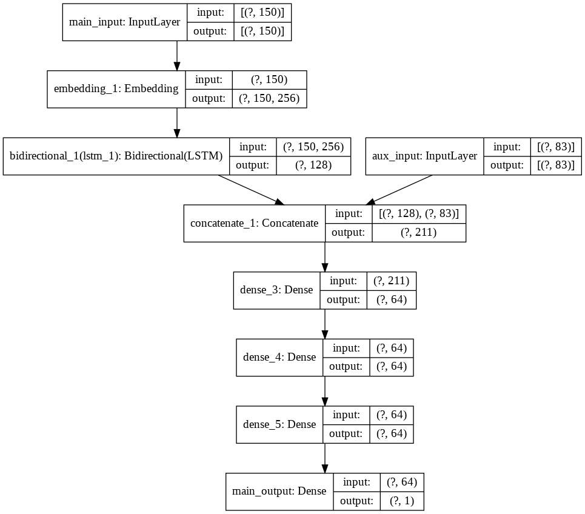

# Deep-CENIC

This repository contains data and code of Deep-CENIC, a deep learning classifier for classifying ideational impact of research papers. In our *Decision Support Systems* paper: ["Classifying the ideational impact of Information Systems review articles: A content-enriched deep learning approach"](https://www.sciencedirect.com/science/article/pii/S0167923620301871), which provides further details on the data and model, Deep-CENIC was evaluated in the context of information systems (IS) review articles (RAs).

## Goals

The repository was developed with reproducibility in mind, offering a starting point to reuse the following components:

1. Definitions and implementation of NLP features (see table in the following Data section)
2. Coding of ideational impact as a gold-standard for training and evaluating ML algorithms
3. Blueprint for a citation analysis repository structure (based on [Cookiecutter Data Science](https://drivendata.github.io/cookiecutter-data-science/))

## Data

The dataset contains IS RAs published in major IS journals ([Lowry et al. 2013](http://misq.org/evaluating-journal-quality-and-the-association-for-information-systems-senior-scholars-journal-basket-via-bibliometric-measures-do-expert-journal-assessments-add-value.html)) between 2000 and 2014. A forward search has been conducted on a sample of the original dataset comprising only citing publications, which cite a RA from the IS business value domain and appeared in a journal included in the Senior Scholars' basket of journals. The citation data was extracted from Google Scholar and Web of Science. A large scale coding of the ideational impact of IS RAs was conducted, which serves as the input for the Deep-CENIC model. The data is structured into three stages:

1. raw
2. interim
3. processed

Due to copyright restrictions some data has been removed from the repository or is presented in truncated form:

- Raw TEI files: TEI files contain the full text of published papers and have therefore been removed. Refer to [GROBID](https://github.com/kermitt2/grobid/) for details on how to generate TEI files from PDF papers.
- raw/LR.csv, interim/LR.csv and interim/CP.csv contain paper abstracts which have been truncated.
- interim/CITATION.csv contain citation sentences which have been truncated and only a random sample has been retained in the repository.

The final dataset ([FEATURE_FRAME.csv](data/processed/FEATURE_FRAME.csv)) is fully available:

| Feature                         | Description                                                                          | Data Type | Source                                                                |
|---------------------------------|--------------------------------------------------------------------------------------|-----------|-----------------------------------------------------------------------|
| citation_key_lr               | Bibtex citation key                                                                  | String    | raw                                                                   |
| citation_key_cp               | Bibtex citation key                                                                  | String    | raw                                                                   |
| focal_citations                | Number of citations toward the focal RA                                              | Integer   | [summarize_citation_df](src/feature_frame.py)                 |
| textual                         | Number of textual citations                                                          | Integer   | [is_textual_citation](src/citation_extraction.py)             |
| separate                        | Number of standalone citations                                                       | Integer   | [is_separate](src/citation_extraction.py)                      |
| comp_sup                       | Number of comparative and superlative clauses                                        | Integer   | [has_comp_sup](src/citation_extraction.py)                    |
| prp                             | Number of personal pronouns                                                          | Integer   | [has_1st_3rd_prp](src/citation_extraction.py)                |
| pos_0                          | Appearances of POS pattern 0                                                         | Integer   | [find_pos_patterns](src/citation_extraction.py)               |
| pos_1                          | Appearances of POS pattern 1                                                         | Integer   | [find_pos_patterns](src/citation_extraction.py)               |
| pos_2                          | Appearances of POS pattern 2                                                         | Integer   | [find_pos_patterns](src/citation_extraction.py)               |
| pos_3                          | Appearances of POS pattern 3                                                         | Integer   | [find_pos_patterns](src/citation_extraction.py)               |
| pos_4                          | Appearances of POS pattern 4                                                         | Integer   | [find_pos_patterns](src/citation_extraction.py)               |
| pos_5                          | Appearances of POS pattern 5                                                         | Integer   | [find_pos_patterns](src/citation_extraction.py)               |
| sentence_popularity amin       | Number of different citations in the citing sentence (min aggregate)               | Integer   | [get_popularity](src/citation_extraction.py)                   |
| sentence_popularity amax       | Number of different citations in the citing sentence (max aggregate)               | Integer   | [get_popularity](src/citation_extraction.py)                   |
| sentence_popularity mean       | Number of different citations in the citing sentence (mean aggregate)              | Double    | [get_popularity](src/citation_extraction.py)                   |
| context_popularity amin        | Number of different citations in the citing context (min aggregate)                | Integer   | [get_popularity](src/citation_extraction.py)                   |
| context_popularity amax        | Number of different citations in the citing context (max aggregate)                | Integer   | [get_popularity](src/citation_extraction.py)                   |
| context_popularity mean        | Number of different citations in the citing context (mean aggregate)               | Double    | [get_popularity](src/citation_extraction.py)                   |
| sentence_density amin          | Focal citations divided by total citations in the citing sentence (min aggregate)  | Double    | [get_density](src/citation_extraction.py)                      |
| sentence_density amax          | Focal citations divided by total citations in the citing sentence (max aggregate)  | Double    | [get_density](src/citation_extraction.py)                      |
| sentence_density mean          | Focal citations divided by total citations in the citing sentence (mean aggregate) | Double    | [get_density](src/citation_extraction.py)                      |
| context_density amin           | Focal citations divided by total citations in the citing context (min aggregate)   | Double    | [get_density](src/citation_extraction.py)                      |
| context_density amax           | Focal citations divided by total citations in the citing context (max aggregate)   | Double    | [get_density](src/citation_extraction.py)                      |
| context_density mean           | Focal citations divided by total citations in the citing context (mean aggregate)  | Double    | [get_density](src/citation_extraction.py)                      |
| position_in_sentence amin     | Position of the reference in citing sentence (min aggregate)                       | Double    | [get_position_in_sentence](src/citation_extraction.py)       |
| position_in_sentence amax     | Position of the reference in citing sentence (max aggregate)                       | Double    | [get_position_in_sentence](src/citation_extraction.py)       |
| position_in_sentence mean     | Position of the reference in citing sentence (mean aggregate)                      | Double    | [get_position_in_sentence](src/citation_extraction.py)       |
| sentence_neg amin              | Negative sentiment of the citing sentence with regards to the RA (min aggregate)   | Double    | [get_sentiment](src/citation_extraction.py)                    |
| sentence_neg amax              | Negative sentiment of the citing sentence with regards to the RA (max aggregate)   | Double    | [get_sentiment](src/citation_extraction.py)                    |
| sentence_neg mean              | Negative sentiment of the citing sentence with regards to the RA (mean aggregate)  | Double    | [get_sentiment](src/citation_extraction.py)                    |
| sentence_neu amin              | Neutral sentiment of the citing sentence with regards to the RA (min aggregate)    | Double    | [get_sentiment](src/citation_extraction.py)                    |
| sentence_neu amax              | Neutral sentiment of the citing sentence with regards to the RA (max aggregate)    | Double    | [get_sentiment](src/citation_extraction.py)                    |
| sentence_neu mean              | Neutral sentiment of the citing sentence with regards to the RA (mean aggregate)   | Double    | [get_sentiment](src/citation_extraction.py)                    |
| sentence_pos amin              | Positive sentiment of the citing sentence with regards to the RA (min aggregate)   | Double    | [get_sentiment](src/citation_extraction.py)                    |
| sentence_pos amax              | Positive sentiment of the citing sentence with regards to the RA (max aggregate)   | Double    | [get_sentiment](src/citation_extraction.py)                    |
| sentence_pos mean              | Positive sentiment of the citing sentence with regards to the RA (mean aggregate)  | Double    | [get_sentiment](src/citation_extraction.py)                    |
| sentence_compound amin         | Compound sentiment of the citing sentence with regards to the RA (min aggregate)   | Double    | [get_sentiment](src/citation_extraction.py)                    |
| sentence_compound amax         | Compound sentiment of the citing sentence with regards to the RA (max aggregate)   | Double    | [get_sentiment](src/citation_extraction.py)                    |
| sentence_compound mean         | Compound sentiment of the citing sentence with regards to the RA (mean aggregate)  | Double    | [get_sentiment](src/citation_extraction.py)                    |
| context_neg amin               | Negative sentiment of the citing context with regards to the RA (min aggregate)    | Double    | [get_sentiment](src/citation_extraction.py)                    |
| context_neg amax               | Negative sentiment of the citing context with regards to the RA (max aggregate)    | Double    | [get_sentiment](src/citation_extraction.py)                    |
| context_neg mean               | Negative sentiment of the citing context with regards to the RA (mean aggregate)   | Double    | [get_sentiment](src/citation_extraction.py)                    |
| context_neu amin               | Neutral sentiment of the citing context with regards to the RA (min aggregate)     | Double    | [get_sentiment](src/citation_extraction.py)                    |
| context_neu amax               | Neutral sentiment of the citing context with regards to the RA (max aggregate)     | Double    | [get_sentiment](src/citation_extraction.py)                    |
| context_neu mean               | Neutral sentiment of the citing context with regards to the RA (mean aggregate)    | Double    | [get_sentiment](src/citation_extraction.py)                    |
| context_pos amin               | Positive sentiment of the citing context with regards to the RA (min aggregate)    | Double    | [get_sentiment](src/citation_extraction.py)                    |
| context_pos amax               | Positive sentiment of the citing context with regards to the RA (max aggregate)    | Double    | [get_sentiment](src/citation_extraction.py)                    |
| context_pos mean               | Positive sentiment of the citing context with regards to the RA (mean aggregate)   | Double    | [get_sentiment](src/citation_extraction.py)                    |
| context_compound amin          | Compound sentiment of the citing context with regards to the RA (min aggregate)    | Double    | [get_sentiment](src/citation_extraction.py)                    |
| context_compound amax          | Compound sentiment of the citing context with regards to the RA (max aggregate)    | Double    | [get_sentiment](src/citation_extraction.py)                    |
| context_compound mean          | Compound sentiment of the citing context with regards to the RA (mean aggregate)   | Double    | [get_sentiment](src/citation_extraction.py)                    |
| self_citation                  | At least one author of the RA and CA is identical                                    | Boolean   | [is_self_citation](src/lr_cp_metadata_extraction.py)        |
| title_similarity               | Semantic similarity of the RA and CA titles                                          | Double    | [get_title_similarity](src/lr_cp_metadata_extraction.py)    |
| abstract_similarity            | Semantic similarity of the RA and CA abstracts                                       | Double    | [get_abstract_similarity](src/lr_cp_metadata_extraction.py) |
| SYN                             | Knowledge developed in the cited RA includes synthesis                               | Boolean   | raw                                                                   |
| TT                              | Knowledge developed in the cited RA includes theory testing                          | Boolean   | raw                                                                   |
| TB                              | Knowledge developed in the cited RA includes theory building                         | Boolean   | raw                                                                   |
| RG                              | Knowledge developed in the cited RA includes identification of research gaps         | Boolean   | raw                                                                   |
| CRI                             | Knowledge developed in the cited RA includes critical assessment                     | Boolean   | raw                                                                   |
| RA                              | Knowledge developed in the cited RA includes development of a research agenda        | Boolean   | raw                                                                   |
| total_references               | Total number of references in the CA                                                 | Integer   | [extract_total_references](src/cp_metadata_extraction.py)    |
| total_citations                | Total number of citations in the CA                                                  | Integer   | [extract_total_citations](src/cp_metadata_extraction.py)     |
| weighted_citation_count       | RA citations divided by total citations                                              | Double    | [\_\_main\_\_](src/feature_frame.py)                            |
| mention_positions_10          | Number of citations in the first 10% of the paper                                    | Integer   | [summarize_citation_df](src/feature_frame.py)                 |
| mention_positions_20          | Number of citations in the second 10% of the paper                                   | Integer   | [summarize_citation_df](src/feature_frame.py)                 |
| mention_positions_30          | Number of citations in the third 10% of the paper                                    | Integer   | [summarize_citation_df](src/feature_frame.py)                 |
| mention_positions_40          | Number of citations in the forth 10% of the paper                                    | Integer   | [summarize_citation_df](src/feature_frame.py)                 |
| mention_positions_50          | Number of citations in the fifth 10% of the paper                                    | Integer   | [summarize_citation_df](src/feature_frame.py)                 |
| mention_positions_60          | Number of citations in the sixth 10% of the paper                                    | Integer   | [summarize_citation_df](src/feature_frame.py)                 |
| mention_positions_70          | Number of citations in the seventh 10% of the paper                                  | Integer   | [summarize_citation_df](src/feature_frame.py)                 |
| mention_positions_80          | Number of citations in the eigth 10% of the paper                                    | Integer   | [summarize_citation_df](src/feature_frame.py)                 |
| mention_positions_90          | Number of citations in the ninth 10% of the paper                                    | Integer   | [summarize_citation_df](src/feature_frame.py)                 |
| mention_positions_100         | Number of citations in the tenth 10% of the paper                                    | Integer   | [summarize_citation_df](src/feature_frame.py)                 |
| heading_category_NA           | Number of citations in the rest of the paper                                         | Integer   | [summarize_citation_df](src/feature_frame.py)                 |
| heading_category_intro        | Number of citations in the introduction section                                      | Integer   | [summarize_citation_df](src/feature_frame.py)                 |
| heading_category_background   | Number of citations in the background section                                        | Integer   | [summarize_citation_df](src/feature_frame.py)                 |
| heading_category_theory       | Number of citations in the theory section                                            | Integer   | [summarize_citation_df](src/feature_frame.py)                 |
| heading_category_methods      | Number of citations in the methods section                                           | Integer   | [summarize_citation_df](src/feature_frame.py)                 |
| heading_category_results      | Number of citations in the results section                                           | Integer   | [summarize_citation_df](src/feature_frame.py)                 |
| heading_category_implications | Number of citations in the implications section                                      | Integer   | [summarize_citation_df](src/feature_frame.py)                 |
| heading_category_appendix     | Number of citations in the appendix                                                  | Integer   | [summarize_citation_df](src/feature_frame.py)                 |
| ref_in_title                  | Citation in the title of the paper                                                   | Boolean   | [check_ref_in_title](src/lr_cp_metadata_extraction.py)     |
| ref_in_heading                | Number of citations in section headings                                              | Integer   | [ref_in_heading](src/citation_extraction.py)                  |
| ref_in_figure_description    | Number of citations in figure captions                                               | Integer   | [ref_in_figDesc](src/citation_extraction.py)                  |
| ref_in_table_description     | Number of citations in table captions                                                | Integer   | [ref_in_tableDesc](src/citation_extraction.py)                |
| USE                             | Ideational impact target variable                                                    | Boolean   | raw                                                                   |

## Setup

1. [Download and install Docker](https://www.docker.com/get-started)
2. Clone this repository: `git clone https://github.com/julianprester/deep-cenic.git`
3. Build docker container: `make dockerize`
4. Run code: `make run`

## Model

The focus of this repository is on developing and providing an ideational impact dataset. Thus, it does not include the machine and deep learning models trained on the data. For details regarding the standard implementations using the Keras and Tensorflow libraries refer to the paper and the figure below.

## References

This repository is part of a broader research program, comprising the following work:

- Schryen, G., Wagner, G., & Benlian, A. (2015). Theory of Knowledge for Literature Reviews: An Epistemological Model, Taxonomy and Empirical Analysis of IS Literature. In: *Proceedings of the 36th International Conference on Information Systems*, Fort Worth, Texas. [link](https://aisel.aisnet.org/icis2015/proceedings/ResearchMethods/8/).
- Wagner, G., Prester, J., Roche, M. P., Benlian, A., & Schryen, G. (2016). Factors Affecting the Scientific Impact of Literature Reviews: A Scientometric Study. In: *Proceedings of the 37th International Conference on Information Systems*, Dublin, Ireland. [link]().
- Prester, J., & Wagner, G., & Schryen, G. (2018). Classifying the Ideational Impact of IS Review Articles: A Natural Language Processing Based Approach. In: *Proceedings of the 39th International Conference on Information Systems*, San Francisco, California. [link](https://aisel.aisnet.org/icis2018/research/Presentations/1/).
- Schryen, G., Wagner, G., Benlian, A., & Paré, G. (2020). A Knowledge Development Perspective on Literature Reviews: Validation of a new Typology in the IS Field. *Communications of the Association for Information Systems*, 46. [link](https://aisel.aisnet.org/cais/vol46/iss1/7/).
- Schryen, G., Wagner, G., & Benlian, A. (2020). Distinguishing Knowledge Impact from Citation Impact: A Methodology for Analysing Knowledge Impact for the Literature Review Genre. Available at SSRN: [link](https://ssrn.com/abstract=3581789).
- Hassan, N. R., Prester, J., & Wagner, G. (2020). Seeking Out Clear And Unique Information Systems Concepts: A Natural Language Processing Approach. In *Proceedings of the 28th European Conference on Information Systems*, Marrackech, Morocco. [link](https://aisel.aisnet.org/ecis2020_rp/128).
- Prester, J., & Wagner, G., Schryen, G., & Hassan, N. R. (2020). Classifying the Ideational Impact of Information Systems Review Articles: A Content-enriched Deep Learning Approach. *Decision Support Systems*, forthcoming. [link](https://www.sciencedirect.com/science/article/pii/S0167923620301871).
